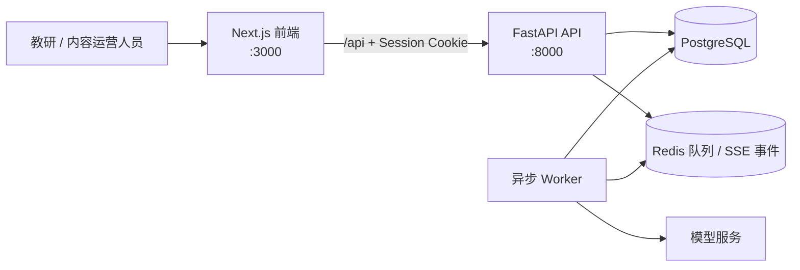

# STEM 题目审核系统

一个面向 STEM 题库的题目导入、异步 AI 审核和结果追溯系统。前端用于题目管理、导入和人工复核；API 负责鉴权、数据与任务编排；Worker 从队列中消费审核任务并调用模型。



## 目录

| 目录 | 说明 |
| --- | --- |
| [`frontend/`](frontend/README.md) | Next.js 16 + React 19 前端，题目管理、导入、审核进度与结果展示。 |
| [`backend/`](backend/README.md) | FastAPI API、PostgreSQL 数据模型、Alembic 迁移与 SSE 接口。 |
| [`worker/`](worker/README.md) | Redis 队列消费者、模型调用、限流、重试与审核结果持久化。 |

## 核心能力

- 批量导入题目，并管理题干、答案、难度、知识点与版本历史。
- 创建异步审核任务，实时展示进度，并支持断线后的状态重取。
- 审核 LaTeX 格式、答案、难度与疑似 AI 生成痕迹，保留可复核的结构化结果。
- 使用 HttpOnly 会话 Cookie 鉴权；题目和审核记录默认按所有者隔离，管理员可跨用户管理。
- 通过 Redis 队列、租约恢复、重试、并发与限流，避免耗时模型调用阻塞 API。

## 前置条件

- Node.js 20+
- Python 3.9+
- PostgreSQL
- Redis

模型访问凭据需要分别配置在后端与 Worker 的本地 `.env` 文件中；请勿提交真实密钥、密码或数据库导出文件。

## 本地启动

以下三个进程需要分别运行。后端与 Worker 必须使用同一个 PostgreSQL 与 Redis。

### 1. 配置并启动 API

```bash
cd backend
cp .env.example .env
# 编辑 .env，至少确认 DATABASE_URL、REDIS_URL、AUTH_SECRET 和管理员账号配置

python3 -m venv .venv
. .venv/bin/activate
python -m pip install -r requirements.lock
python -m pip install -e . --no-deps

alembic upgrade head
uvicorn app.main:app --reload --port 8000
```

API 文档默认位于 `http://localhost:8000/docs`。

### 2. 启动 Worker

```bash
cd worker
cp .env.example .env
# 必须与 backend/.env 使用同一个 DATABASE_URL、REDIS_URL；填写模型服务凭据

python3 -m venv .venv
. .venv/bin/activate
python -m pip install -r requirements.lock
python -m pip install -e . --no-deps

python -m app.worker
```

### 3. 启动前端

```bash
cd frontend
cp .env.example .env.local
npm ci
npm run dev
```

打开 `http://localhost:3000`。浏览器始终请求相对路径 `/api/*`；开发环境会将其转发到 `BACKEND_API_URL`（默认 `http://localhost:8000`）。

## 常用检查

```bash
# 前端
cd frontend && npm run lint && npm run build

# 后端
cd backend && pytest && ruff check .

# Worker
cd worker && pytest && ruff check .
```

## 部署与安全提示

- 生产环境请使用强随机 `AUTH_SECRET`、替换初始管理员密码，并开启 `AUTH_COOKIE_SECURE=true`。
- 为每个模型供应商配置真实的并发、RPM 与 TPM 配额；Worker 可按 Key 池独立限流。
- 生产代理必须允许长连接并关闭 SSE 响应缓冲，以确保审核进度及时送达前端。
- 数据库结构变更应新增 Alembic revision，已提交的迁移不可修改。

更多服务级配置、运行说明与开发约定见各子目录中的 README。
