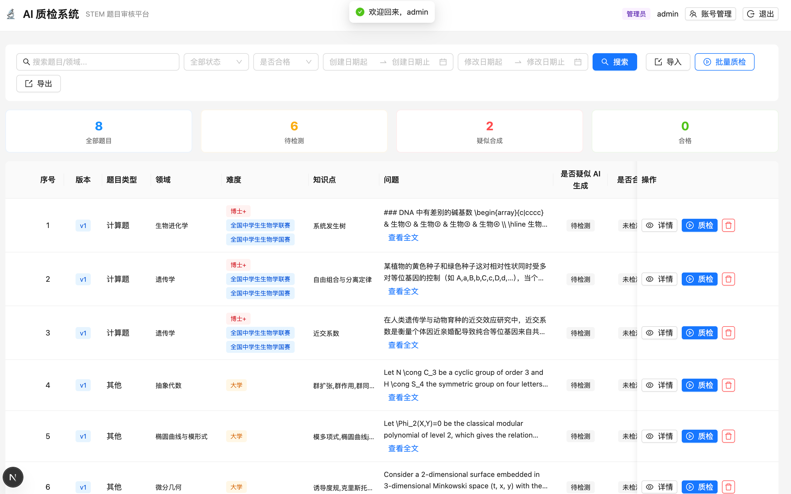
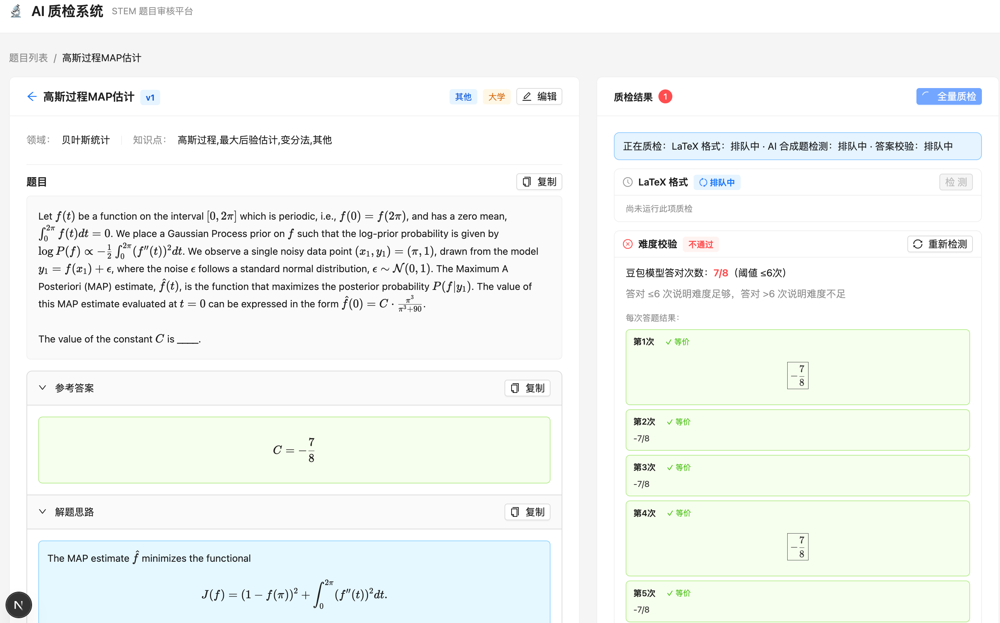
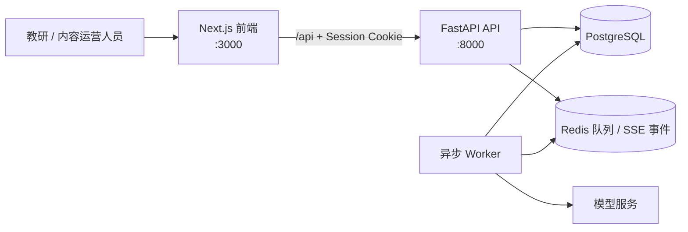
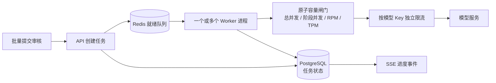

# STEM 题目审核系统

一个面向 STEM 题库的题目导入、异步 AI 审核和结果追溯系统。前端用于题目管理、导入和人工复核；API 负责鉴权、数据与任务编排；Worker 从队列中消费审核任务并调用模型。

## 业务价值

- **把题库审核变成可管理的流程**：批量导入题目后，可按领域、知识点、难度、状态和日期检索；每道题保留版本与审核记录，避免依赖零散的人工沟通。
- **让审核结论可以复核**：答案、LaTeX、难度和疑似 AI 生成痕迹分别检查，保留模型回答、等价判断与人工复核入口，而非只返回一个黑盒结论。
- **降低批量审核的等待成本**：提交任务后即可继续编辑题库；前端通过实时进度和可恢复的状态查询反馈处理过程，不让浏览器等待长时模型调用。
- **兼顾团队协作和数据边界**：普通用户默认只能处理自己的题目；管理员可统一管理账号与全量题库，适合教研、内容运营与质检团队协同使用。

## 产品截图

**题目列表：支持筛选、导入导出、批量质检，以及题目总量、待检、疑似合成和合格等运营指标。**



**题目详情：左侧查看题干、答案与解题思路，右侧实时跟踪 LaTeX、难度、答案等审核项及多次独立求解结果。**





## 目录

本仓库是聚合仓库：三个服务保留各自的 GitLab 仓库与提交历史，并通过 Git 子模块锁定协作版本。首次获取代码请使用：

```bash
git clone --recurse-submodules https://github.com/peteryipikachu-cpu/stem-system.git
```

已有克隆可执行 `git submodule update --init --recursive`；需要更新到各子模块远端 `main` 时，先在对应子模块完成提交与推送，再更新本仓库中的子模块指针。

| 目录 | 说明 |
| --- | --- |
| [`frontend/`](frontend/README.md) | Next.js 16 + React 19 前端，题目管理、导入、审核进度与结果展示。 |
| [`backend/`](backend/README.md) | FastAPI API、PostgreSQL 数据模型、Alembic 迁移与 SSE 接口。 |
| [`worker/`](worker/README.md) | Redis 队列消费者、模型调用、限流、重试与审核结果持久化。 |

## 核心能力

- 批量导入题目，并管理题干、答案、难度、知识点与版本历史。
- 创建异步审核任务，实时展示进度，并支持断线后的状态重取。
- 审核 LaTeX 格式、答案、难度与疑似 AI 生成痕迹，保留可复核的结构化结果。
- 使用 HttpOnly 会话 Cookie 鉴权；题目和审核记录默认按所有者隔离，管理员可跨用户管理。
- 通过 Redis 队列、租约恢复、重试、并发与限流，避免耗时模型调用阻塞 API。

## 技术要点

- **前端体验**：Next.js 16、React 19、TypeScript、Ant Design 与 SWR；使用 KaTeX 渲染数学内容，并通过相对路径 `/api/*` 保持 Cookie 同源访问。
- **可靠的任务编排**：FastAPI 只负责创建任务与提供查询/SSE 事件；Worker 独立执行模型调用，PostgreSQL 持久化题目、任务、结果与事件，Redis 作为调度和限流层。
- **可恢复的异步链路**：任务带有租约；Worker 会回收过期租约、补投遗漏的就绪任务与依赖唤醒，网络与上游可重试错误采用抖动退避，连续失败时通过熔断保护上游。
- **安全与权限**：登录使用 HttpOnly 会话 Cookie；API 的所有者范围与管理员边界在服务端校验，密钥和本地环境配置均不纳入版本控制。

## 并发能力

系统将“接收任务”与“执行模型调用”拆开：API 可快速响应批量提交，Worker 在后台按容量领取任务，因此模型耗时不会占住浏览器请求或 API 连接。



- **单进程异步并发**：Worker 默认可同时处理 `12` 个活动任务（`WORKER_CONCURRENCY`），可按机器资源和供应商配额调整。
- **水平扩展**：可启动多个独立 Worker 进程；任务领取与容量控制基于共享的 PostgreSQL/Redis 状态，避免仅依赖单机内存协调。
- **多 Key 吞吐**：`DOUBAO_API_KEYS` 支持 Key 池。每把 Key 都拥有独立的总并发、阶段并发、RPM、TPM 与熔断桶；例如深度推理限额为每 Key `2` 时，配置 `4` 把 Key 可提供最多 `8` 个深度推理并发位，仍受 `WORKER_CONCURRENCY` 约束。
- **分阶段保护**：规则检查、深度推理、快速比对、答案审核与综合分析使用各自的并发闸门，避免长时任务挤占低延迟检查的容量。
- **故障不丢任务**：默认租约覆盖长时模型读取；Worker 退出或租约过期后，任务会重新入队。上游临时故障按退避重试，超过阈值后进入熔断窗口，避免雪崩式重试。

## 前置条件

- Node.js 20+
- Python 3.9+
- PostgreSQL
- Redis

模型访问凭据需要分别配置在后端与 Worker 的本地 `.env` 文件中；请勿提交真实密钥、密码或数据库导出文件。

## 本地启动

以下三个进程需要分别运行。后端与 Worker 必须使用同一个 PostgreSQL 与 Redis。

### 1. 配置并启动 API

```bash
cd backend
cp .env.example .env
# 编辑 .env，至少确认 DATABASE_URL、REDIS_URL、AUTH_SECRET 和管理员账号配置

python3 -m venv .venv
. .venv/bin/activate
python -m pip install -r requirements.lock
python -m pip install -e . --no-deps

alembic upgrade head
uvicorn app.main:app --reload --port 8000
```

API 文档默认位于 `http://localhost:8000/docs`。

### 2. 启动 Worker

```bash
cd worker
cp .env.example .env
# 必须与 backend/.env 使用同一个 DATABASE_URL、REDIS_URL；填写模型服务凭据

python3 -m venv .venv
. .venv/bin/activate
python -m pip install -r requirements.lock
python -m pip install -e . --no-deps

python -m app.worker
```

### 3. 启动前端

```bash
cd frontend
cp .env.example .env.local
npm ci
npm run dev
```

打开 `http://localhost:3000`。浏览器始终请求相对路径 `/api/*`；开发环境会将其转发到 `BACKEND_API_URL`（默认 `http://localhost:8000`）。

## 常用检查

```bash
# 前端
cd frontend && npm run lint && npm run build

# 后端
cd backend && pytest && ruff check .

# Worker
cd worker && pytest && ruff check .
```

## 部署与安全提示

- 生产环境请使用强随机 `AUTH_SECRET`、替换初始管理员密码，并开启 `AUTH_COOKIE_SECURE=true`。
- 为每个模型供应商配置真实的并发、RPM 与 TPM 配额；Worker 可按 Key 池独立限流。
- 生产代理必须允许长连接并关闭 SSE 响应缓冲，以确保审核进度及时送达前端。
- 数据库结构变更应新增 Alembic revision，已提交的迁移不可修改。

更多服务级配置、运行说明与开发约定见各子目录中的 README。
