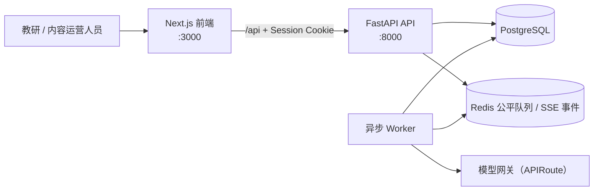
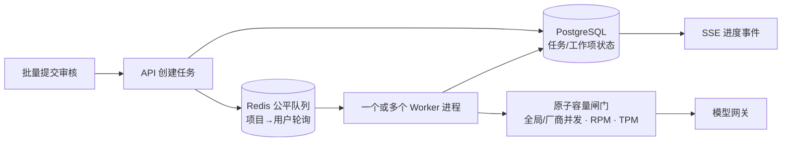

# STEM 题目审核系统

一个面向 STEM 题库的题目导入、异步 AI 审核和结果追溯系统。前端用于题目管理、导入和人工复核；API 负责鉴权、数据与任务编排；Worker 从队列中消费审核任务并调用模型。

## 业务价值

- **把题库审核变成可管理的流程**：批量导入题目后，可按领域、知识点、难度、状态和日期检索；每道题保留版本与审核记录，避免依赖零散的人工沟通。
- **让审核结论可以复核**：LaTeX 格式、答案等价性、难度分级与疑似 AI 生成痕迹分别检查，保留模型回答、等价判断与人工复核入口，而非只返回一个黑盒结论。
- **降低批量审核的等待成本**：提交任务后即可继续编辑题库；前端通过 SSE 实时进度和可恢复的状态查询反馈处理过程，不让浏览器等待长时模型调用。
- **兼顾团队协作和数据边界**：普通用户默认只能处理自己的题目；项目管理员管理本项目成员与配额；管理员可统一管理账号、项目与全量题库。

## 产品截图

**题目列表：支持筛选、导入导出、批量质检，以及题目总量、待检、疑似合成和合格等运营指标。**


**题目详情：左侧查看题干、答案与解题思路，右侧实时跟踪难度分级评测各层进度与多次独立求解结果。**



```mermaid
flowchart LR
  User["教研 / 内容运营人员"] --> Web["Next.js 前端\n:3000"]
  Web -->|"/api + Session Cookie"| API["FastAPI API\n:8000"]
  API --> DB[("PostgreSQL")]
  API --> Queue[("Redis 公平队列 / SSE 事件")]
  Worker["异步 Worker"] --> Queue
  Worker --> DB
  Worker --> Models["模型网关（APIRoute）"]
```

## 仓库结构

本聚合仓库保存三个服务的完整源码（普通目录而非子模块），即使 GitLab 暂不可访问也可完整浏览与恢复；三个服务在 GitLab 中各自独立开发、独立发布。

| 目录 | 说明 |
| --- | --- |
| [`stem-system-frontend/app/`](stem-system-frontend/app/README.md) | Next.js 16 + React 19 前端：题目管理、Excel 导入、审核进度、队列监控与用量分析。 |
| [`stem-system-backend/app/`](stem-system-backend/app/README.md) | FastAPI API：鉴权、项目/账号/配额管理、任务编排、SSE 推送与 Alembic 迁移。 |
| [`stem-system-worker/app/`](stem-system-worker/app/README.md) | Redis 队列消费者：模型调用、公平调度、限流重试、租约恢复与结果持久化。 |

根目录另有 `backend/`、`frontend/`、`worker/` 三个**历史镜像目录，已停止维护**，请勿在其中修改代码；`AGENTS.md` 是代理工作指南与项目知识库；`reports/` 存放本机发版说明与周报（不提交）。

## 核心能力

- **题目导入与去重**：固定表头 Excel 批量导入；上传时本地 n-gram 快速拦截近乎相同的题目，上传后异步模型判定改写幅度较大的相似题；相似度检测提供管理员总开关。
- **难度分级评测**：新题/新版本经 L0（LaTeX 规则 + AI 合成题检测双门控）→ L1 → L2 → L3 分层作答与等价比对，按“答对门槛”逐层晋级或降级定级；策略与模型在任务创建时快照固化。
- **答案校验**：Pass@K 多模型独立求解 + 答案等价比对，保留每次求解与比对的结构化结果，失败转人工复核。
- **版本与复核**：题目保留版本历史，保存新版本自动重置检测状态；疑似问题可人工复核销案。
- **组织与配额**：admin / 项目管理员 / 普通用户三级权限；项目级模型配置与分层策略；账号日上限、月上限、月预算配额门控，超限前置拒绝。
- **用量与成本**：每次模型请求逐行记账（Token、耗时、分档计价、汇率、成本），支持单任务用量明细与项目级成本汇总。
- **队列治理**：队列监控支持暂停、恢复、取消、重试与卡住任务诊断；Worker 心跳 + 主循环看门狗双保险，僵尸进程自杀重启、租约秒级接管。

## 并发与调度

系统将“接收任务”与“执行模型调用”拆开：API 快速响应批量提交并入队，Worker 在后台按容量领取执行，模型耗时不占住浏览器请求或 API 连接。


```mermaid
flowchart LR
  Submit["批量提交审核"] --> API["API 创建任务"]
  API --> DB[("PostgreSQL\n任务/工作项状态")]
  API --> Ready[("Redis 公平队列\n项目→用户轮询")]
  Ready --> Workers["一个或多个 Worker 进程"]
  Workers --> Gate["原子容量闸门\n全局/厂商并发 · RPM · TPM"]
  Gate --> Models["模型网关"]
  Workers --> DB
  DB --> Events["SSE 进度事件"]
```

- **调用治理**：全局与厂商的并发、RPM、TPM、单价分档统一存于数据库 `model_governance` 配置，管理端即时调整、即时生效；价格按请求快照入账。
- **公平队列**：按项目→用户轮询出队，避免单一批量任务垄断；`interactive > batch > background` 三级优先级带保证手动发起的任务响应优先。
- **水平扩展**：Worker 单进程默认 16 个执行槽（12 个上游调用 + 4 个编排/恢复），可启动多个独立进程；任务领取与容量控制基于共享的 PostgreSQL/Redis 状态。
- **故障不丢任务**：工作项带租约，Worker 退出或租约过期自动重新入队；上游可重试错误按指数退避重试，重试耗尽转人工复核；被中断的模型调用台账照常结算，成本统计不漏不重。

## 前置条件

- Node.js 20+
- Python 3.11+（本机使用 Conda `/opt/anaconda3/bin/python`）
- PostgreSQL
- Redis

模型访问凭据配置在各组件本地 `.env` 文件中（不纳入版本控制）；请勿提交真实密钥、密码或数据库导出文件。

## 本地启动

三个进程在独立终端分别运行，**后端与 Worker 必须使用同一个 PostgreSQL 库与 Redis**（本机业务库为 `stem_audit`；历史上曾因两端连不同库导致任务全部排队不动）。启动顺序：后端 API → Worker → 前端。

### 1. 启动 API

```bash
cd stem-system-backend/app
cp .env.example .env   # 确认 DATABASE_URL、REDIS_URL、AUTH_SECRET 与管理员账号

env DATABASE_URL='postgresql+asyncpg://pikachu@localhost:5432/stem_audit' \
    REDIS_URL='redis://localhost:6379/0' \
    /opt/anaconda3/bin/uvicorn app.main:app --host 127.0.0.1 --port 8000
```

数据库迁移由 `alembic upgrade head` 执行（仅追加新 revision，不改已提交迁移）。API 文档位于 `http://127.0.0.1:8000/docs`。

### 2. 启动 Worker

```bash
cd stem-system-worker/app
env DATABASE_URL='postgresql+asyncpg://pikachu@localhost:5432/stem_audit' \
    REDIS_URL='redis://localhost:6379/0' \
    /opt/anaconda3/bin/python -m app.worker
```

### 3. 启动前端

```bash
cd stem-system-frontend/app
npm ci
npm run dev -- --hostname 127.0.0.1 --port 3000
```

打开 `http://127.0.0.1:3000`。浏览器始终请求相对路径 `/api/*`；开发环境由 Next.js 转发到 `BACKEND_API_URL`（默认 `http://localhost:8000`），生产由 Nginx/Istio 转发并透传 SSE。前端固定 3000 端口，被占用时停旧进程而非改端口。

## 常用检查

```bash
# 前端
cd stem-system-frontend/app && npm run lint && npm run build

# 后端
cd stem-system-backend/app && /opt/anaconda3/bin/python -m pytest && /opt/anaconda3/bin/ruff check .

# Worker
cd stem-system-worker/app && /opt/anaconda3/bin/python -m pytest && /opt/anaconda3/bin/ruff check .
```

## 部署与发布

- 三个服务在 GitLab 独立仓库，**仅 Release Tag 触发** CI/CD：`v1.2.3-dev-rc1` 等预发标签自动部署对应环境，`v1.2.3` 手动部署生产；Worker 无对外 HTTP 入口。
- 建议发布顺序：**backend → worker → frontend**；数据库迁移不随流水线自动执行，需人工 `alembic upgrade head`。
- 生产代理必须允许长连接并关闭 SSE 响应缓冲，以确保审核进度及时送达前端。

## 安全提示

- 生产使用强随机 `AUTH_SECRET`、替换初始管理员密码并开启 `AUTH_COOKIE_SECURE=true`；登录为 HttpOnly 会话 Cookie，令牌带版本号，登出/改密即时吊销。
- 登录限流、输入净化、密码强度与密钥防护等基线已内置；密钥仅存本地 `.env` 或部署配置，禁止写入代码、日志或提交。

更多服务级配置、CI/CD 变量与开发约定见各子目录 README 与根目录 `AGENTS.md`。
