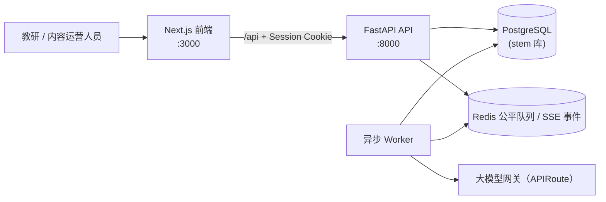
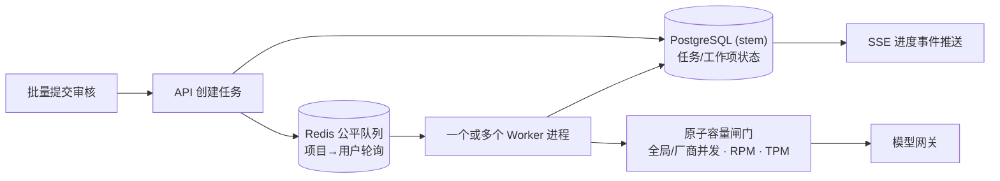

# STEM 题目审核系统

一个面向 STEM 题库的题目导入、异步 AI 审核和结果追溯系统（产品界面名「AI 质检系统」）。前端用于题目管理、导入和人工复核；API 负责鉴权、数据与任务编排；Worker 从队列中消费审核任务并调用大模型。

---

## 💡 业务价值

- **把题库审核变成可管理的流程**：批量导入题目后，可按项目、领域、知识点、难度、状态和日期等多维检索；每道题保留完整版本与审核记录，避免依赖零散的人工沟通。
- **让审核结论可以复核与溯源**：LaTeX 格式规范、答案等价性、难度分级与疑似 AI 生成痕迹分别检查；全链路透出大模型 `Request ID` 并提供原始 Trace JSON 详情，避免黑盒结论。
- **降低批量审核的等待成本**：提交任务后即可继续编辑题库；前端通过 SSE 实时推送进度和可恢复的状态查询反馈处理过程，不让浏览器等待长时模型调用。
- **项目视角精细化用量与成本治理**：支持下钻查看每个项目的**累计调用成本 (CNY)、提交质检次数、模型调用次数、Token 消耗**以及项目内部每位成员的消耗占比与质检报告。
- **兼顾团队协作和数据安全边界**：普通用户默认只能处理自己的题目；项目管理员管理本项目成员、项目难度策略与上传/调用配额；管理员可统一管理账号、项目与全量题库。

---

## 🖼️ 产品功能与界面说明

顶部导航包含 **项目管理**、**模型日志**、**用户管理**、**模型管理**、**队列监控** 与 **健康巡检** 核心入口。

### 1. 项目管理 (Project Landing)
- **项目概览与进度**：项目卡片展示题目目标与合格完成进度、累计调用成本与请求数、成员构成（项目管理员 / 普通用户）。
- **项目专属调用成本分析**：卡片集成 `调用成本` 入口，下钻弹窗直观展示项目总消耗、成员提交质检次数（含质检报告链接）、模型调用次数、Prompt/Completion Token 消耗分拆、CNY 成本与项目内成本占比。
- **操作防误触与收纳**：【开始 / 暂停】按钮配置 `Popconfirm` 气泡二次确认；将【停止项目】与【删除项目】高危/敏感操作统一收纳至右下角的 **`更多 ▾`** 下拉菜单中。
- **全站成本大盘**：支持查看全项目成本汇总，采用二层树形展开表格 (`Expandable Table`)，顶置 4 大宏观 KPI 汇总卡片（全项目总成本、提交质检总次数、模型调用总次数、Token 消耗总量），底部总结行与展开列垂直精确对齐。

### 2. 题目列表与审核 (Question Workspace)
- **多维筛选与聚合指标**：支持按状态 / 是否合格 / 分级状态 / 难度等级 / 提交人 / 日期等多维筛选；顶部汇总卡片实时展现待检测、疑似合成、合格与 LaTeX 通过率。
- **检索与操作**：关键字搜索同时匹配标题、问题、参考答案与解题思路；搜索过程提供防连击锁与全局 Spin 遮罩；支持 Excel 批量导入导出、选择性导出与版本追溯。

### 3. 题目详情与深度评测 (Question Detail & Assessment)
- **渲染与多模型解题**：左侧查看题干、答案与解题思路（KaTeX 科学公式渲染）；右侧实时跟踪难度分级评测各层进度与多次独立求解结果（统一 `<final>` 最终答案协议），保留 AI 合成题检测与相似题检测的判断依据。

### 4. 大模型调用日志大盘 (Model Logs Dashboard)
- **Request ID 全链路对账**：所有模型请求落库 `Request ID`，优先捕获上游网关对账 Header，支持前端一键复制。
- **多维联合筛选与排序**：独立【模型日志】大盘页面，支持按时间范围 (预设今天/近7天/近30天)、Request ID、模型名称、所属项目、审核阶段与执行状态联合检索；支持按请求时间、耗时与成本进行服务端 Server-side 排序。
- **Trace 全文 Drawer**：点击一键查看大模型调用的完整 Prompt 提示词、配置参数与原始返回细节，支持高亮格式化 JSON 与复制。

### 5. 用户管理与权限配额 (User & Quota Management)
- **分级账号体系**：支持管理员 / 项目管理员 / 普通用户三级账号；支持 Excel 批量上传（用户名 + 密码）及项目管理员对自己项目内用户的下发与编辑。
- **配额与成本跟踪**：可配置题目上传上限、日上限、月上限与月预算配额；列表直观展示每个账号名下的提交质检次数与 RMB 成本。

### 6. 模型管理与分层治理 (Model & Policy Governance)
- **调用治理**：支持全局与单项目配置；全局网关与各厂商并发、RPM、TPM 双层容量限额；多用户公平调度与重试参数；模型分档单价与计费币种，调整即时生效。
- **分层策略**：答案比对模型独立配置；L1 过易筛选 / L2 难度复核 / L3 终极定级三层各带启用开关，可分别配置作答模型、运行次数（Pass@K）、答对门槛，满足门槛逐层晋级、不满足退回定级；Qwen 模型显式配置 `thinking_budget: 32768` 思考上限参数。

### 7. 队列监控与健康巡检 (Queue Monitor & Health Patrol)
- **队列监控**：Worker 在线状态，排队中 / 执行中 / 等待依赖 / 已暂停等队列统计，共享网关与各厂商容量占用，以及活跃任务的进度与卡住诊断。
- **健康巡检**：相似校验卡住、队列缺失 / 残留、阻塞停滞、排队过久、Worker 心跳、未定稿任务与未结算台账等实时检测结果；Worker 每 5 秒自动修复，本页面供管理员人工兜底。

---

## 🏗️ 系统架构


```mermaid
flowchart LR
  User["教研 / 内容运营人员"] --> Web["Next.js 前端\n:3000"]
  Web -->|"/api + Session Cookie"| API["FastAPI API\n:8000"]
  API --> DB[("PostgreSQL\n(stem 库)")]
  API --> Queue[("Redis 公平队列 / SSE 事件")]
  Worker["异步 Worker"] --> Queue
  Worker --> DB
  Worker --> Models["大模型网关（APIRoute）"]
```

---

## 📦 仓库结构

本聚合仓库保存三个服务的完整源码（普通 Git 目录而非子模块），三个服务在 GitLab 中各自独立开发、独立发布。

| 目录 | 说明 |
| --- | --- |
| [`stem-system-frontend/app/`](stem-system-frontend/app/README.md) | Next.js 16 + React 19 前端：题目管理、Excel 导入、审核进度、队列监控、模型日志与用量成本分析。 |
| [`stem-system-backend/app/`](stem-system-backend/app/README.md) | FastAPI API：鉴权、项目/账号/配额管理、任务编排、模型日志 Trace API、SSE 推送与 Alembic 迁移。 |
| [`stem-system-worker/app/`](stem-system-worker/app/README.md) | Redis 队列消费者：模型调用、Request ID 提取、公平调度、思考预算调优、租约恢复与结果持久化。 |

> ⚠️ 根目录 `AGENTS.md` 为项目代理指南与开发规范；`reports/` 目录存放本机发版说明与周报（不提交）。

---

## ⚡ 并发与公平调度

系统将“接收任务”与“执行模型调用”解耦：API 快速响应批量提交并入队，Worker 在后台按容量领取执行，模型耗时不占住浏览器请求或 API 连接。


```mermaid
flowchart LR
  Submit["批量提交审核"] --> API["API 创建任务"]
  API --> DB[("PostgreSQL (stem)\n任务/工作项状态")]
  API --> Ready[("Redis 公平队列\n项目→用户轮询")]
  Ready --> Workers["一个或多个 Worker 进程"]
  Workers --> Gate["原子容量闸门\n全局/厂商并发 · RPM · TPM"]
  Gate --> Models["模型网关"]
  Workers --> DB
  DB --> Events["SSE 进度事件推送"]
```

- **调用治理**：全局与厂商的并发、RPM、TPM、单价分档统一存于数据库 `model_governance` 配置，管理端即时调整、即时生效；价格按请求快照入账。
- **公平队列**：按项目→用户轮询出队，避免单一批量任务垄断；`interactive > batch > background` 三级优先级带保证手动发起的任务响应优先。
- **水平扩展**：Worker 单进程默认 16 个执行槽（12 个上游调用 + 4 个编排/恢复），可启动多个独立进程；任务领取与容量控制基于共享的 PostgreSQL/Redis 状态。
- **故障不丢任务**：工作项带租约，Worker 退出或租约过期自动重新入队；上游可重试错误按指数退避重试，重试耗尽转人工复核；被中断的模型调用台账照常结算，成本统计不漏不重。

---

## 🛠️ 本地开发与启动说明

### 前置条件
- **Node.js**: 20+
- **Python**: 3.11+（本机统一使用 Conda `/opt/anaconda3/bin/python`）
- **PostgreSQL** & **Redis**

> 🔴 **关键规则**：后端与 Worker **必须指向同一个 PostgreSQL 数据库 `stem`**（`postgresql+asyncpg://pikachu@localhost:5432/stem`），否则会导致任务无法消费一直卡在排队状态！

### 启动步骤

必须在三个独立终端分别运行，启动顺序为：**后端 API → Worker → 前端**。

#### 1. 启动后端 API (端口 8000)
```bash
cd stem-system-backend/app

env DATABASE_URL='postgresql+asyncpg://pikachu@localhost:5432/stem' \
    REDIS_URL='redis://localhost:6379/0' \
    /opt/anaconda3/bin/uvicorn app.main:app --host 127.0.0.1 --port 8000
```
- API 文档位于：`http://127.0.0.1:8000/docs`

#### 2. 启动异步 Worker 消费进程
```bash
cd stem-system-worker/app

env DATABASE_URL='postgresql+asyncpg://pikachu@localhost:5432/stem' \
    REDIS_URL='redis://localhost:6379/0' \
    /opt/anaconda3/bin/python -m app.worker
```

#### 3. 启动 Next.js 前端 (端口 3000)
```bash
cd stem-system-frontend/app

npm ci
npm run dev -- --hostname 127.0.0.1 --port 3000
```
- 前端访问地址：`http://127.0.0.1:3000`（前端请求统一走同源 `/api/*`，开发阶段由 Next.js 重写转发至 `http://127.0.0.1:8000`）。

---

## 🧪 代码检查与构建验证

```bash
# 1. 前端代码检查与生产编译
cd stem-system-frontend/app && npm run lint && npm run build

# 2. 后端 API 单元测试与代码检查
cd stem-system-backend/app && /opt/anaconda3/bin/python -m pytest && /opt/anaconda3/bin/ruff check .

# 3. Worker 消费服务测试与检查
cd stem-system-worker/app && /opt/anaconda3/bin/python -m pytest && /opt/anaconda3/bin/ruff check .
```

---

## 🚀 代码提交与推送纪律

本仓库对应的三个子组件为 Git 独立仓库：
1. 修改代码后须先进入对应目录执行 `git status` 检查；
2. 先后提交各子仓库代码：`git add <相关文件>` -> `git commit -m "规范中文说明"` -> `git push origin main`；
3. 更新根目录规则/文档后，在根目录提交并推送至 GitHub (`peteryipikachu-cpu/stem-system`) 的 `main` 分支。
4. 后端 `reports/` 仅保留在本机，**严禁提交**。

---

## 🔐 安全与生产部署提示

- **会话与鉴权**：登录采用 HttpOnly Session Cookie，令牌带 `ver` 版本号，账号登出/管理员重置密码时 `token_version += 1` 即时吊销全量已有 Token；生产环境必须配置 `AUTH_SECRET`（长度 ≥ 32 位）。
- **生产代理**：Nginx/Istio 生产转发需开启 SSE 响应流式透出（`proxy_buffering off;`），并设置适当长连接超时。

更多各服务的配置明细与高级用法，请参阅各子目录下的 `README.md` 与根目录 `AGENTS.md` 指南。
