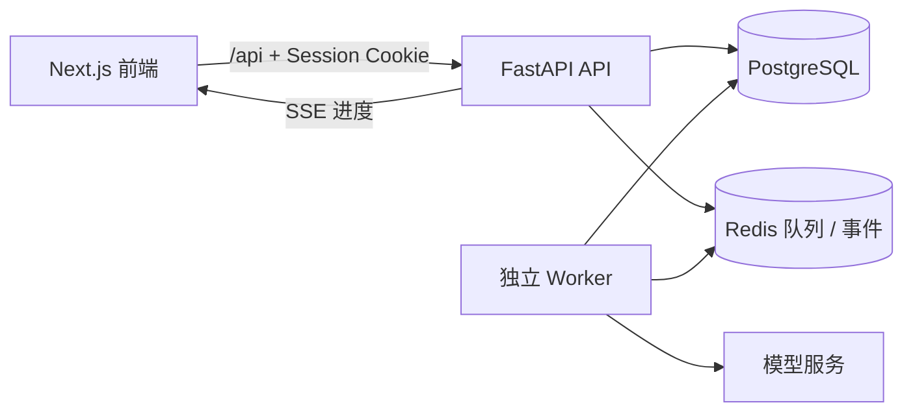

# STEM 题目审核系统后端

STEM 题目审核系统的 API 与数据服务。它负责题库、用户、版本、审核任务和审核结果的可信持久化；模型调用由独立 Worker 异步执行，API 不会阻塞等待上游模型完成。

## 业务价值

- **题目资产化**：将题干、答案、难度、知识点和版本变更沉淀为可管理的数据资产。
- **审核流程化**：创建单题或批量审核任务，记录进度、失败、人工复核和最终结果。
- **结果可解释**：保留模型审核的结构化结果、答案对比和运行事件，支持后续复盘。
- **权限可控**：通过 HttpOnly 会话 Cookie 实现登录；题目和审核记录默认按所有者隔离，管理员拥有跨用户管理权限。

## 架构边界



- API 创建 `CheckRun` 与工作项并入队。
- Worker 领取工作项、调用模型、持久化结果并写入事件。
- 前端通过 SSE 获取进度；断线时可重新查询任务状态。

## 技术要点

- **FastAPI + Pydantic**：明确请求/响应契约和错误语义。
- **SQLAlchemy Async + asyncpg**：异步访问 PostgreSQL；Alembic 管理可顺序执行的数据库迁移。
- **Redis**：队列、审核事件、并发控制和租约恢复。
- **幂等与可靠性**：审核创建支持 `Idempotency-Key`；任务有租约、重试、超时和故障恢复机制。
- **安全设计**：密码哈希、HttpOnly Cookie、角色校验和所有者数据范围控制。

## 本地运行

前置条件：Python 3.9+、PostgreSQL、Redis。

```bash
python3 -m venv .venv
. .venv/bin/activate
pip install -e ".[dev]"
cp .env.example .env

# 首次使用时创建 DATABASE_URL 指定的数据库；已有数据库时可安全重复执行。
stem-init-db
alembic upgrade head

uvicorn app.main:app --reload --port 8000
```

启动后可访问：

- 健康检查：`http://localhost:8000/healthz`
- OpenAPI 文档：`http://localhost:8000/docs`

`DATABASE_URL` 必须指向实际 PostgreSQL；宿主机运行时不要使用仅容器内部可解析的主机名。

## 环境变量

完整示例见 [`.env.example`](.env.example)。最常用的变量如下：

| 变量 | 说明 |
| --- | --- |
| `DATABASE_URL` | PostgreSQL 异步连接串；普通 `postgresql://` 形式会自动规范化为 `postgresql+asyncpg://`。 |
| `REDIS_URL` | Redis 连接地址。 |
| `CORS_ORIGINS` | 允许携带 Cookie 的前端来源，多个来源用逗号分隔。 |
| `INITIAL_ADMIN_USERNAME` / `INITIAL_ADMIN_PASSWORD` | 首次启动时创建管理员；生产环境必须替换示例值。 |
| `AUTH_SECRET` | 会话签名密钥，必须使用高强度随机值。 |
| `AUTH_COOKIE_SECURE` | HTTPS 环境设为 `true`。 |

模型 Key 与并发配额配置由 Worker 使用；请在 Worker 仓库配置模型访问凭据。不要提交 `.env`、数据库转储或真实密钥。

## 质量检查

```bash
pytest
ruff check .
alembic upgrade head
```

## 相关服务

- Web 界面：[stem-system-frontend](https://gitlab.bodenai.com/agi-project/stem-system-frontend)
- 异步审核执行器：[stem-system-worker](https://gitlab.bodenai.com/agi-project/stem-system-worker)

## 开发约定

- 数据模型变化必须新增 Alembic revision，禁止修改已提交的迁移。
- 路由使用 Pydantic schema；受保护接口使用当前用户与角色依赖。
- 新增审核类型须同时覆盖工作项、队列、结果落库、完成状态与 SSE 事件链路。
