# AI 质检系统使用说明 · 管理员

> 适用版本：v0.0.13 起（2026-08-11）。
> 本文面向**管理员**与**项目管理员**；普通用户的题目导入 / 质检 / 查看操作见《使用说明 · 普通用户》。

## 1. 角色与权限

| 功能 | 管理员 | 项目管理员 |
| --- | --- | --- |
| 顶部导航 | 项目管理 / 用户管理 / 模型管理 / 队列监控 / 健康巡检 | 项目管理 / 用户管理 / 模型设置 / 项目队列 |
| 项目 | 创建、编辑、删除任意项目；全量调用成本 | 编辑、删除自己所在项目；本项目调用成本 |
| 用户管理 | 全部账号：角色升降、配额、项目分配、批量上传 | 仅本项目内普通用户的下发与编辑（角色固定普通用户） |
| 模型管理 / 模型设置 | 全局与全部项目级配置、调用治理、功能开关 | 仅自己所在项目的模型设置（跟随全局或自定义） |
| 队列监控 / 项目队列 | 全部任务与成本统计 | 仅本项目任务；成本统计仅管理员可见 |
| 健康巡检 | ✅ | — |

普通用户相关操作（导入、质检、查看详情）与《使用说明 · 普通用户》一致，本文不再重复。

## 2. 项目管理

### 2.1 创建与编辑项目

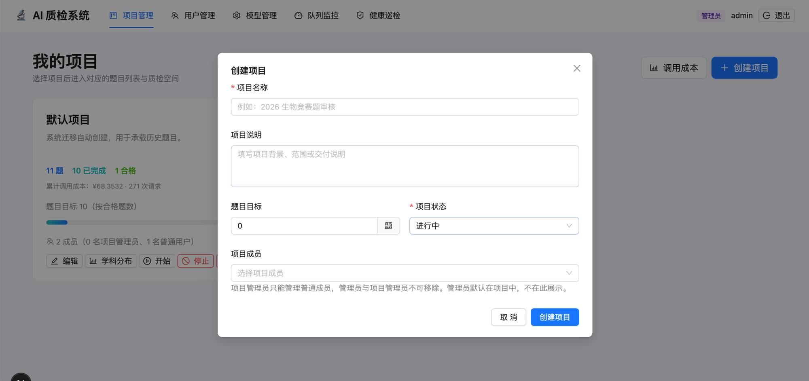

- 右上角「创建项目」新建；卡片「编辑」打开同一弹窗修改。
- 弹窗字段：项目名称（必填）、项目说明、题目目标（单位：题）、项目状态（进行中 / 已暂停 / 已停止）、项目成员（多选）。
- 题目目标用于卡片进度展示，也用于成员题目上传上限总和校验（仅目标 > 0 的项目）。
- 成员选择仅展示可管理成员：项目管理员只能管理普通成员，管理员与项目管理员不可移除；管理员默认在项目内，不在此展示。

### 2.2 项目操作

- **学科分布**：弹窗按学科并排对比「全部题目数量」与「已质检合格数量」两组条形图，一眼看清学科结构与合格分布。

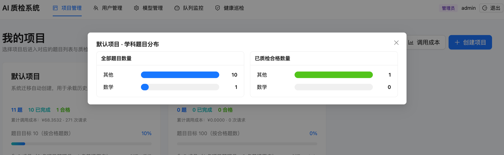

- **开始 / 停止**：卡片按钮切换项目状态；暂停可恢复，停止后不再接收新任务。
- **删除**：逻辑删除，对所有角色不可见，成员的「可访问项目」同步清理；历史成本台账保留。
- **调用成本**：每张项目卡片直接展示「累计调用成本：¥金额 · N 次请求」（下图红框处）；右上角「调用成本」按钮另开「项目与用户调用成本」弹窗，按项目 / 按用户两个维度汇总请求数、Token 与成本；管理员可见全部，项目管理员仅见自己所在项目。

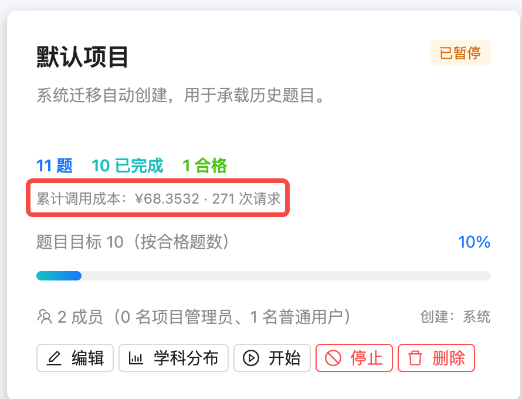

- 点击卡片进入题目列表。

## 3. 用户管理

管理员视角：

列表列：用户名、手机号、角色、状态、所属项目、累计请求次数、累计 RMB 成本、题目上传上限（已上传 / 上限）、生效配额（日 / 月 / 月预算，标注来源为个人或全局）。

### 3.1 下发新账号

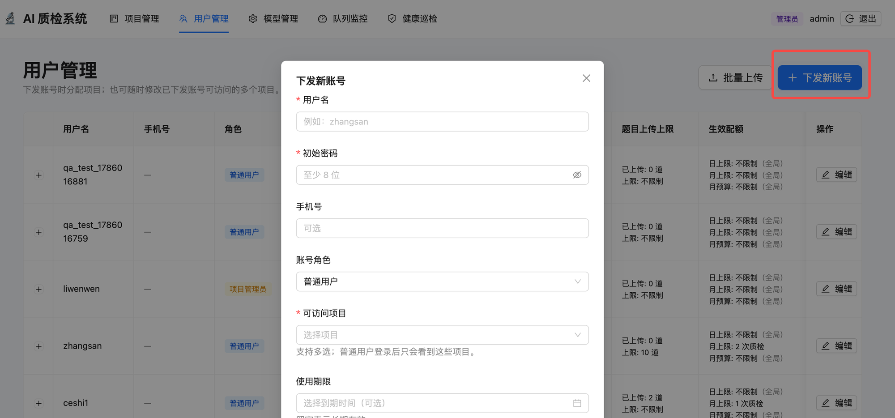

- 管理员可下发管理员 / 项目管理员 / 普通用户；项目管理员仅能下发普通用户，且只能分配到自己所在项目。
- 弹窗字段：用户名（必填）、初始密码（必填，须 ≥8 位且含大小写字母、数字、特殊字符）、手机号（可选）、账号角色、可访问项目（必填、多选；普通用户登录后只会看到这些项目）、使用期限（可选，留空长期有效）。
- 可设置题目上传上限与日 / 月 / 月预算配额（留空继承全局默认）。

### 3.2 批量上传

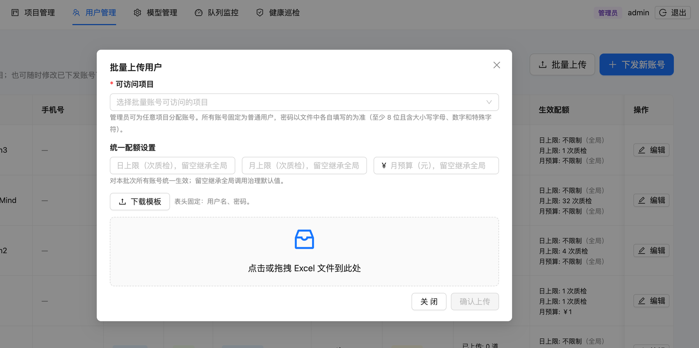

- 「可访问项目」必填：管理员可为任意项目分配账号；项目管理员仅限自己所在项目。本入口创建的账号固定为普通用户。
- 「下载模板」：Excel 表头固定两列 `用户名、密码`，密码由文件逐行填写，须 ≥8 位且含大小写字母、数字、特殊字符。
- 「统一配额设置」：日上限 / 月上限 / 月预算对本批次所有账号统一生效；留空继承全局调用治理默认值。
- 点击或拖拽 Excel 上传；解析后逐行校验，用户名或密码任一为空 / 不合规的行标出错误并禁用「确认上传」；用户名已存在或文件内重复的行自动跳过并在结果中说明。

### 3.3 编辑账号

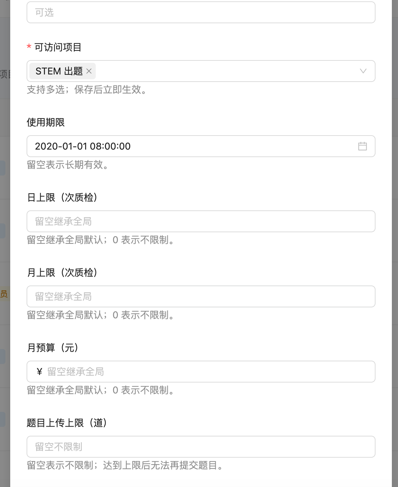

- 可修改角色（仅管理员）、账户状态、手机号、可访问项目（多选，保存后立即生效）、使用期限（留空表示长期有效）。
- 日上限 / 月上限（次质检）与月预算（元）：留空继承全局默认，0 表示不限制。
- 题目上传上限（道）：留空表示不限制；达到上限后该账号无法再提交题目。
- 已删除项目不会出现在可访问项目中。

### 3.4 项目管理员视角

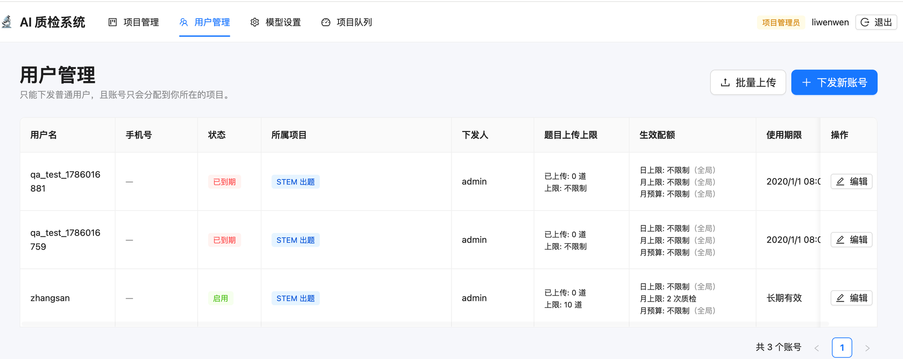

- 页头明示「只能下发普通用户，且账号只会分配到你所在的项目」；列表仅展示本项目内的普通用户，含状态、所属项目、下发人、题目上传上限、生效配额与使用期限。
- 同样提供「批量上传」与「下发新账号」，但可访问项目仅限自己所在项目；越权操作会被拒绝（403/404）。
- 项目管理员顶部导航另有「模型设置」与「项目队列」，分别见 4.1 与第 5 节。

## 4. 模型管理 / 模型设置

### 4.1 配置范围与功能开关

- **配置范围**：右上角下拉选择「全局」或「项目：XX」；项目未独立配置时显示「跟随全局配置」横幅，保存后固化为独立副本（copy-on-write），之后的全局修改不再影响该项目，也可恢复跟随全局。

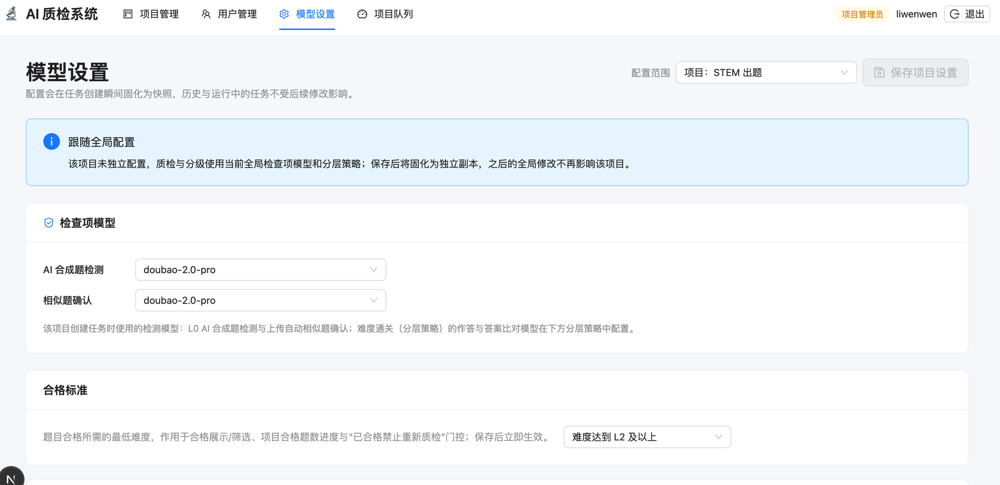

- 项目管理员的入口为「模型设置」，配置范围固定为自己所在项目，仅能保存项目级配置，不能修改全局。
- **功能开关**：相似度检测总开关；关闭后新上传 / 保存新版本不再触发异步相似题检测（上传同步本地去重不受影响）。

### 4.2 调用治理与成本预算控制

1. **网关与厂商容量限额**：APIRoute 全局网关（并发 / RPM / TPM 总上限）与豆包、Gemini、DeepSeek、Qwen、Kimi、Claude 各厂商额度；任务派发同时受两层约束。
2. **多用户公平调度与异常重试**：项目公平份额（默认 8）、用户公平份额（默认 3）、最大重试次数（5）、退避基数（2 秒）、随机抖动（1.0 秒）、USD/CNY 汇率。
3. **全局账号配额默认值**：日上限 / 月上限（次质检）与月预算；账号未设专属值时继承。
4. **模型单价配置与计费币种**：每 1,000,000 Token 分档单价与缓存命中折扣；每次请求按创建时单价快照入账。

### 4.3 分层策略

- **合格标准**：题目合格所需的最低难度（L1–L3 可选，默认 L2 及以上），作用于合格展示 / 筛选、项目合格题数进度与“已合格禁止重新质检”门控；判定每次实时读库，保存后立即生效。
- **答案比对**：独立配置比对模型，只判断最终结论是否语义等价。
- **L1 过易筛选 / L2 难度复核 / L3 终极定级**：每层带启用开关，可配置作答模型（可多选）、运行次数（Pass@K）、答对门槛（操作符 + 次数）；满足门槛晋级、不满足退回定级。
- **快照语义**：所有配置在任务创建瞬间固化；修改只影响新任务，历史与运行中任务不变。

### 4.4 检查项模型卡

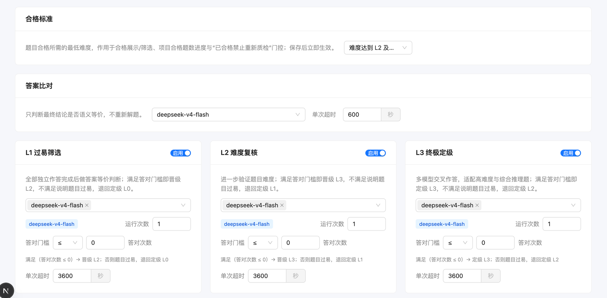

- 每个检查项以「模型卡」形式独立配置：AI 合成题检测、相似题确认、答案比对、L1 过易筛选 / L2 难度复核 / L3 终极定级等；卡内含启用开关、作答模型（可多选）、运行次数（Pass@K）、答对门槛（操作符 + 次数）。
- 上图为难度分级相关区域：顶部「合格标准」卡，其下答案比对卡与 L1–L3 三张层卡；每张层卡下方实时给出门槛语义说明（如「满足（答对次数 ≤ 0）⇒ 晋级 L2；否则题目过易，退回定级 L0」）。
- 所有检查项模型按全局与项目两个范围配置（见 4.1 配置范围）。

## 5. 队列监控 / 项目队列

- 顶部指标：Worker 在线数、排队中、执行中、等待依赖、已暂停、当前未解决的人工复核、需关注、卡住、最长可执行等待。
- 共享网关占用：全局与各厂商并发 / RPM / TPM 占用与上限。
- 筛选：当前活跃任务 / 全部健康状态 / 全部 Provider；默认「当前活跃任务」视图，无活跃任务时列表为空（No data）。

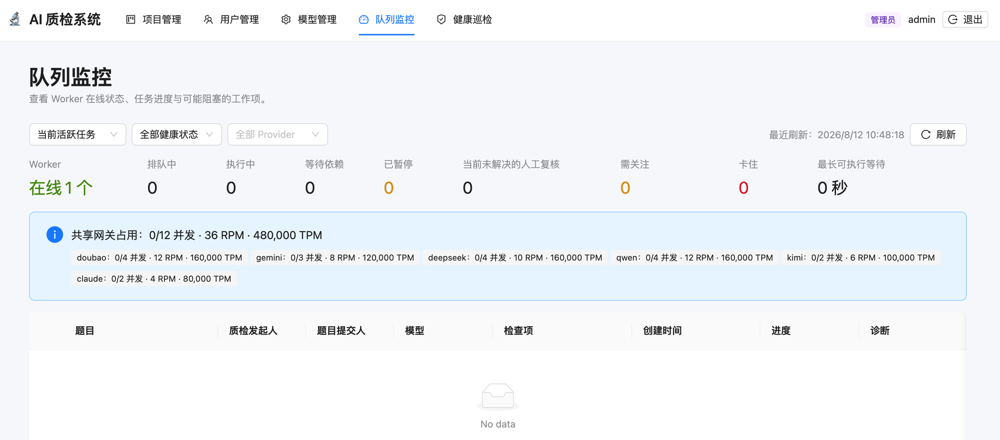

- 任务表：题目、质检发起人、题目提交人、模型（按厂商高亮）、检查项、创建时间、进度、诊断。
- 对停滞或异常任务可暂停、恢复、取消、重试。
- 项目管理员的入口为「项目队列」：仅展示自己所在项目的任务，成本统计仅管理员可见；暂停 / 恢复 / 取消 / 重试等操作仅限本项目任务，越权拒绝。

## 6. 健康巡检（仅管理员）

- Worker 每 5 秒自动修复丢队、相似校验卡死、队列残留等问题；本页供人工兜底。
- 指标卡：相似校验卡住、队列缺失、队列残留、阻塞停滞、排队过久、Worker 心跳、未定稿任务（应为 0）、未结算台账（应为 0）。
- 异常列表按严重度 / 类别 / 摘要 / 详情 / 操作展示；无异常时显示「未发现异常，系统健康」（下图），出现异常时列表给出对应行与人工修复按钮。

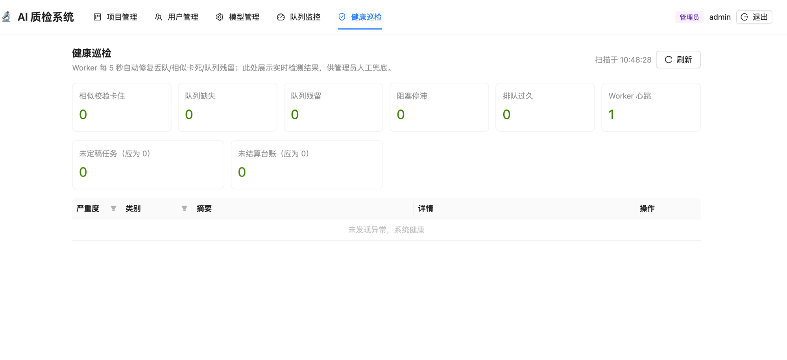

## 7. 常见问题

1. **改了模型 / 策略，任务里还是旧配置？**
   快照语义：任务创建瞬间固化模型、策略与单价；修改只影响新任务。
2. **用户发起质检报 409？**
   账号或项目配额用尽；可在用户管理调整该账号配额，或等次日 / 次月自动恢复。
3. **任务卡住怎么办？**
   队列监控看「诊断」列与卡住指标；健康巡检可一键修复；系统对临时性上游错误自动退避重试，重试耗尽转人工复核。
4. **删除的项目还能恢复吗？**
   逻辑删除仅隐藏展示，数据与台账保留；如需恢复请联系研发处理。
5. **批量上传部分账号没创建？**
   查看响应 `skipped` 说明：用户名已存在或文件内重复的行会被跳过，其余正常创建。
