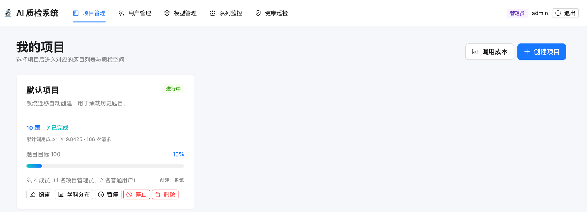
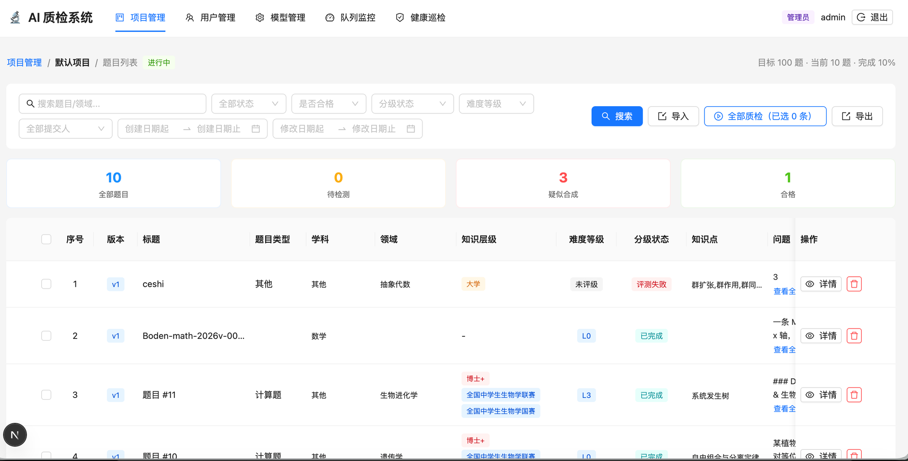
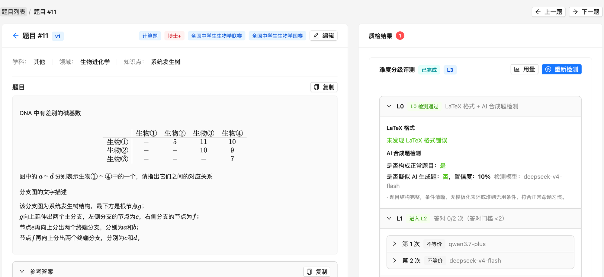
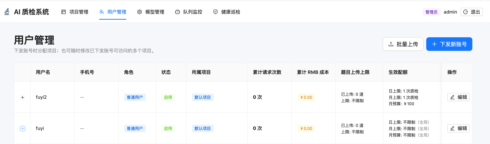
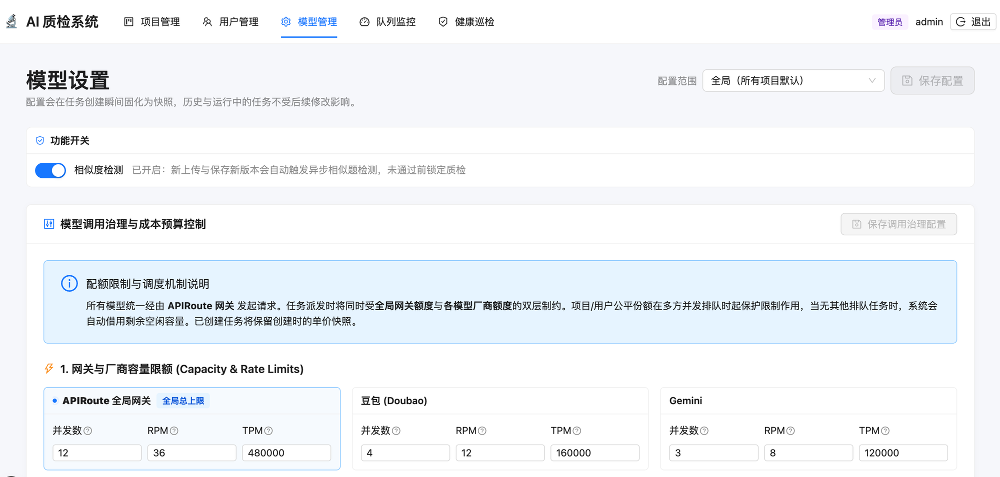
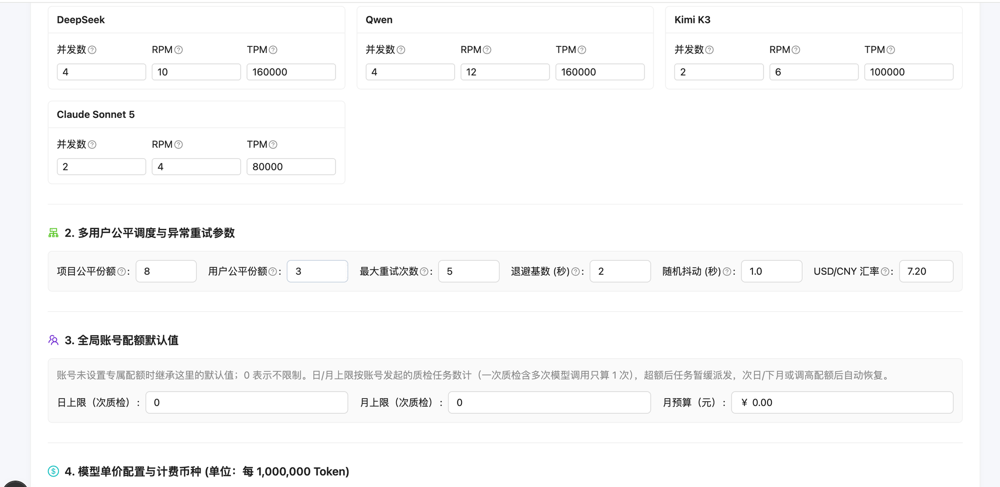
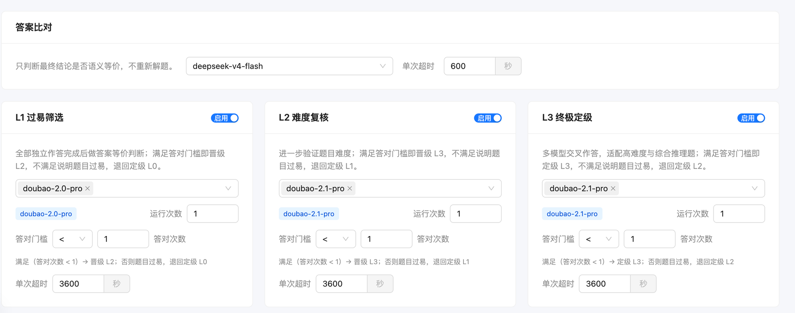
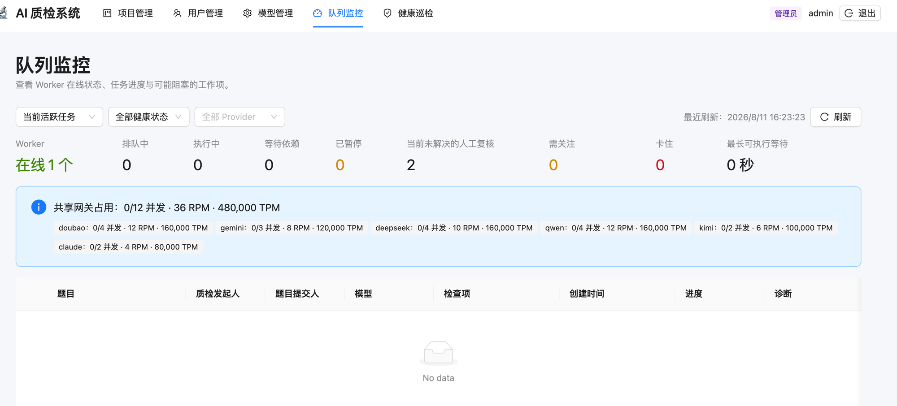
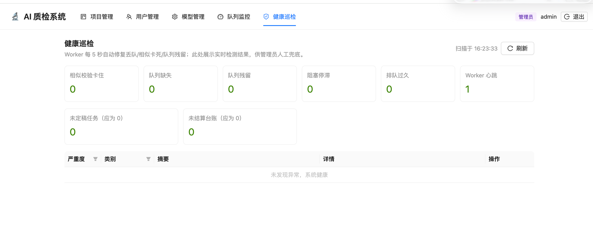

# AI 质检系统使用说明

> 适用版本：v0.0.13 起（2026-08-11）。文中标注 📷 的截图槽位待补充，清单见文末[附录](#附录截图槽位清单)。

## 1. 系统概述

AI 质检系统面向 STEM 题库，把「题目导入 → 批量质检 → 难度分级 → 结果追溯 → 成本分析」做成一条可管理、可复核的流水线：

- **题目导入**：固定表头 Excel 批量导入，上传时本地去重拦截、上传后异步相似题检测。
- **批量质检**：LaTeX 格式校验、AI 合成题检测、多模型独立求解（Pass@K）与答案等价比对、L0→L3 难度分级评测。
- **结果追溯**：每道题保留版本历史与每次模型求解/比对的结构化结果，失败转人工复核。
- **治理与成本**：项目级模型与分层策略配置、账号配额门控、逐请求成本台账与项目级用量分析。

### 1.1 角色与权限

| 功能 | 管理员 | 项目管理员 | 普通用户 |
| --- | --- | --- | --- |
| 顶部导航 | 项目管理 / 用户管理 / 模型管理 / 队列监控 / 健康巡检 | 项目管理 / 用户管理 | 项目管理 |
| 项目 | 创建、编辑、删除任意项目；查看全量调用成本 | 编辑、删除自己所在项目；查看本项目调用成本 | 查看所在项目，上传与质检自己的题目 |
| 用户管理 | 全部账号（角色升降、配额、项目分配、批量上传） | 仅本项目内普通用户的下发与编辑 | — |
| 模型管理 / 队列监控 / 健康巡检 | ✅ | — | — |

### 1.2 登录

📷 **截图槽位 S-01**：登录页（用户名 / 密码输入与错误提示）。

- 登录成功后以 HttpOnly 会话 Cookie 维持登录；账号可设有效期，过期或被停用的账号无法登录。
- 密码复杂度：至少 8 位，且包含大写字母、小写字母、数字、特殊字符。

## 2. 项目管理

### 2.1 创建与编辑项目

📷 **截图槽位 S-02**：创建 / 编辑项目弹窗（名称、描述、题目目标示例）。

- 右上角「创建项目」新建项目；卡片「编辑」可修改名称、描述与题目目标。
- 题目目标用于计算卡片进度百分比，也用于成员上传上限总和校验。

### 2.2 项目卡片信息

- 状态标签：进行中 / 已暂停 / 已停止。
- 「N 题 · N 已完成」与累计调用成本（¥ 与请求次数）。
- 成员构成：N 成员（N 名项目管理员、N 名普通用户）；创建人。

### 2.3 项目操作

- **学科分布**（📷 S-03）：查看项目内题目的学科分布统计。
- **暂停 / 停止**：暂停可恢复；停止后项目不再接收新任务。
- **删除**：逻辑删除，删除后对所有角色不可见，相关成员的「可访问项目」同步清理；历史成本台账保留用于汇总。
- **调用成本**（📷 S-04）：打开「项目与用户调用成本」弹窗，按项目与按用户两个维度汇总请求数、Token 与成本；管理员可见全部项目，项目管理员仅见自己所在项目。
- 点击项目卡片进入该项目的题目列表与质检空间。

## 3. 题目列表

### 3.1 检索与指标

- 关键词搜索（题目 / 领域）；筛选条件：全部状态、是否合格、分级状态、难度等级、全部提交人、创建日期区间、修改日期区间。
- 四张指标卡：全部题目 / 待检测 / 疑似合成 / 合格。
- 列表列：序号、版本、标题、题目类型、学科、领域、知识层级、难度等级、分级状态、知识点、问题预览；操作列含「详情」与删除。

### 3.2 导入题目

📷 **截图槽位 S-05**：导入弹窗（选择 Excel 后显示「解析成功，共 N 道题目」）。

- Excel 固定表头 8 列：`标题、题目类型、领域、难度、知识点、问题、答案、解题思路`；列顺序无关，名称须完全一致；「问题」为空的行自动跳过。
- 解析成功后分批提交导入。
- 上传时本地 n-gram 快速拦截近乎相同的题目；上传后异步触发模型相似题检测（管理员可在模型管理关闭总开关）。

### 3.3 批量质检与导出

- 勾选题目后点击「全部质检（已选 N 条）」；未勾选时对当前筛选结果发起。
- 提交后列表顶部出现实时进度条（📷 S-06）：「批量质检：排队 N，运行 N，完成 N/N，人工复核 N」，进度经 SSE 实时推送。
- 「导出」将当前列表导出为 Excel。
- 删除题目会先取消该题进行中的任务，再物理删除。

## 4. 题目详情

### 4.1 题目内容区（左侧）

- 标题、版本号（v1 / v2 …）、标签（题目类型、知识层级、竞赛 / 知识点标签）；学科 / 领域 / 知识点。
- 题目、参考答案、解题思路以 KaTeX 渲染公式，各块支持一键复制。
- 「编辑」保存为新版本：版本号 +1，检测状态重置并重新质检。
- 右上角「上一题 / 下一题」在同一列表内快速切换。

### 4.2 质检结果区（右侧）

- **难度分级评测**卡片：状态（已完成 / 运行中 / 评测失败等）与最终定级 L0–L3。
  - 「用量」打开本任务的模型调用明细（Token、耗时、单价快照、成本）。
  - 「重新检测」发起重检（受账号配额与已定级重检门控约束）。
- **L0**：LaTeX 格式 + AI 合成题检测双门控，展示是否构成正常题目、是否疑似 AI 生成题及置信度、检测模型与判断依据。
- **L1 过易筛选 / L2 难度复核 / L3 终极定级**：每层展示作答模型、运行次数（Pass@K）、答对门槛，以及每次独立求解的等价比对结论（等价 / 不等价）与所用模型。
- 晋级规则：答对次数满足门槛即晋级下一层；不满足说明题目过易，退回定级。
- 评测失败、疑似合成等异常会在「质检结果」标题上显示问题数角标；展开查看失败原因与判断依据，必要时人工复核销案（📷 S-07）。

## 5. 用户管理

管理员视角：

列表列：用户名、手机号、角色、状态、所属项目、累计请求次数、累计 RMB 成本、题目上传上限（已上传 / 上限）、生效配额（日上限 / 月上限 / 月预算，括号标注来源为个人设置或全局默认）。

### 5.1 下发新账号

📷 **截图槽位 S-08**：下发新账号弹窗（角色、密码、可访问项目示例）。

- 管理员可下发管理员 / 项目管理员 / 普通用户；项目管理员仅能下发普通用户，且只能分配到自己所在的项目。
- 可访问项目为必填项；密码须满足复杂度；可同时设置题目上传上限与日 / 月 / 月预算配额（留空继承全局默认）。

### 5.2 批量上传

📷 **截图槽位 S-09**：批量上传弹窗（解析表格、错误提示与模板下载按钮）。

- Excel 固定表头仅两列：`用户名、密码`；弹窗内可下载模板。
- 解析后逐行校验：用户名或密码任一为空、密码不满足复杂度的行会标出错误并阻止提交。
- 弹窗内的日上限 / 月上限 / 月预算输入框对本批次所有账号统一生效。
- 用户名已存在或文件内重复的行自动跳过，并在结果中逐条说明。

### 5.3 编辑账号

📷 **截图槽位 S-10**：编辑用户弹窗（可访问项目多选、配额输入框）。

- 可修改账号角色（仅管理员）、账户状态、手机号、可访问项目（多选）、题目上传上限与生效配额。
- 已删除的项目不会出现在可访问项目中。

### 5.4 项目管理员视角

📷 **截图槽位 S-11**：项目管理员的用户管理页（仅本项目普通用户）。

- 仅可见与可管理自己所在项目内的普通用户；下发与编辑的项目分配限定在自己所在项目范围。

## 6. 模型管理（管理员）

### 6.1 配置范围与功能开关

- **配置范围**：全局（所有项目默认）或切换到单个项目；项目可自定义或跟随全局（📷 S-12）。
- **功能开关**：相似度检测总开关。关闭后新上传 / 保存新版本不再触发异步相似题检测。
- 页面提示：配置会在任务创建瞬间固化为快照，历史与运行中的任务不受后续修改影响。

### 6.2 调用治理与成本预算控制

1. **网关与厂商容量限额**：APIRoute 全局网关（并发 / RPM / TPM 总上限）与豆包、Gemini、DeepSeek、Qwen、Kimi、Claude 各厂商额度；任务派发同时受两层约束。
2. **多用户公平调度与异常重试**：项目公平份额、用户公平份额、最大重试次数、退避基数、随机抖动、USD/CNY 汇率。
3. **全局账号配额默认值**：日上限 / 月上限（次质检）与月预算；账号未设专属值时继承。
4. **模型单价配置与计费币种**：按每 1,000,000 Token 的分档单价与缓存命中折扣；每次请求按创建时单价快照入账。

### 6.3 分层策略

- **答案比对**：独立配置比对模型与单次超时，只判断最终结论是否语义等价、不重新解题。
- **L1 / L2 / L3**：每层带启用开关，可配置作答模型（可多选）、运行次数（Pass@K）、答对门槛（操作符 + 次数）、单次超时；层间晋级 / 退回规则见 4.2。
- **快照语义**：修改只影响之后新建的任务；历史任务显示旧模型属预期行为（见 FAQ 1）。

### 6.4 检查项模型卡

📷 **截图槽位 S-13**：检查项模型卡区域（AI 合成题检测 / 相似题确认等模型与参数）。

- AI 合成题检测、相似题确认等检查项所用模型在此按全局与项目两个范围配置。

## 7. 队列监控（管理员）

- 顶部指标：Worker 在线数、排队中、执行中、等待依赖、已暂停、当前未解决的人工复核、需关注、卡住、最长可执行等待。
- 共享网关占用：全局与各厂商的并发 / RPM / TPM 占用与上限。
- 筛选：当前活跃任务 / 全部健康状态 / 全部 Provider。
- 任务表：题目、质检发起人、题目提交人、模型（按厂商高亮）、检查项、创建时间、进度、诊断。
- 对停滞或异常任务可执行暂停、恢复、取消、重试等操作（📷 S-14）。

## 8. 健康巡检（管理员）

- Worker 每 5 秒自动修复丢队、相似校验卡死、队列残留等问题；本页展示实时检测结果，供管理员人工兜底。
- 指标卡：相似校验卡住、队列缺失、队列残留、阻塞停滞、排队过久、Worker 心跳、未定稿任务（应为 0）、未结算台账（应为 0）。
- 异常列表按严重度 / 类别 / 摘要 / 详情展示，并提供修复操作（📷 S-15）；无异常时显示「未发现异常，系统健康」。

## 9. 常见问题

1. **改了模型配置，为什么任务里还是旧模型？**
   配置在任务创建瞬间快照固化；已创建（含运行中）的任务保留创建时的模型与单价，修改只影响新任务。
2. **质检进度长时间不动怎么办？**
   先看队列监控的 Worker 是否在线；再查看任务的「诊断」列与健康巡检的卡住 / 等待依赖指标。临时性上游错误会自动退避重试，重试耗尽转人工复核。
3. **发起质检报 409 是什么意思？**
   账号日上限 / 月上限 / 月预算或项目成员上传上限已用完；提示会带剩余配额，次日 / 次月或调高配额后自动恢复。
4. **导入 Excel 报错？**
   核对 8 列表头是否与 `标题、题目类型、领域、难度、知识点、问题、答案、解题思路` 完全一致；「问题」为空的行会被跳过。
5. **批量上传用户提示密码不合规？**
   密码须 ≥8 位且含大小写字母、数字、特殊字符；弹窗会标出 Excel 行号，修正后重新上传。
6. **删除的项目去哪了？**
   逻辑删除：对所有角色不可见，成员的可访问项目同步清理；历史成本台账保留用于用量汇总。

## 附录：截图槽位清单

| 槽位 | 页面 / 内容 | 说明 |
| --- | --- | --- |
| S-01 | 登录页 | 用户名 / 密码输入框与错误提示 |
| S-02 | 创建 / 编辑项目弹窗 | 名称、描述、题目目标填写示例 |
| S-03 | 学科分布弹窗 | 项目内题目学科分布统计 |
| S-04 | 项目与用户调用成本弹窗 | 有数据的按项目 / 按用户汇总表 |
| S-05 | 题目导入弹窗 | 选择 Excel 后显示「解析成功，共 N 道题目」 |
| S-06 | 批量质检进度条 | 题目列表顶部排队 / 运行 / 完成 / 人工复核计数 |
| S-07 | 题目详情质检结果问题区 | 评测失败 / 人工复核原因展开状态 |
| S-08 | 下发新账号弹窗 | 角色、密码、可访问项目填写示例 |
| S-09 | 批量上传弹窗 | 解析表格、错误提示与模板下载按钮 |
| S-10 | 编辑用户弹窗 | 可访问项目多选、配额输入框 |
| S-11 | 项目管理员视角用户管理页 | 仅本项目普通用户列表 |
| S-12 | 模型管理配置范围 | 下拉切换到某项目（自定义 / 跟随全局） |
| S-13 | 检查项模型卡区域 | AI 合成题检测 / 相似题确认模型与参数 |
| S-14 | 队列监控有活跃任务 | 任务进度与暂停 / 恢复 / 取消 / 重试操作 |
| S-15 | 健康巡检异常列表 | 异常行与修复按钮（可在出现异常时补拍） |
